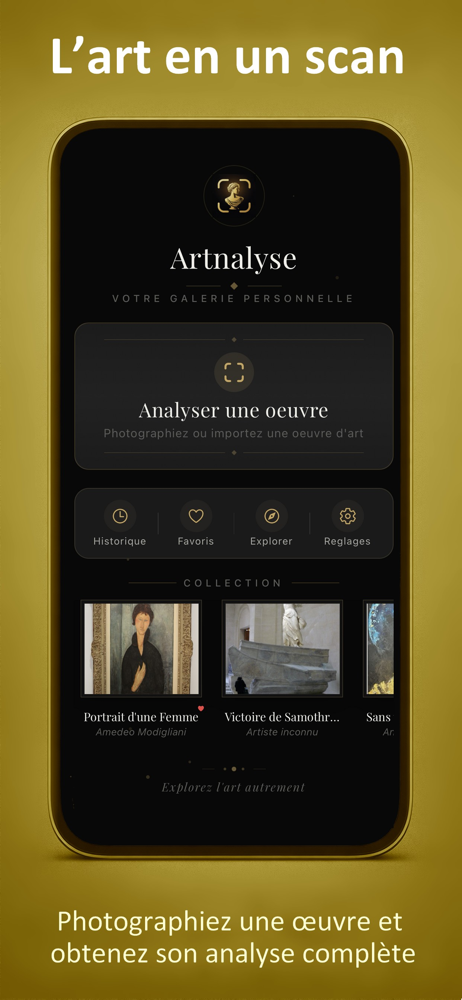
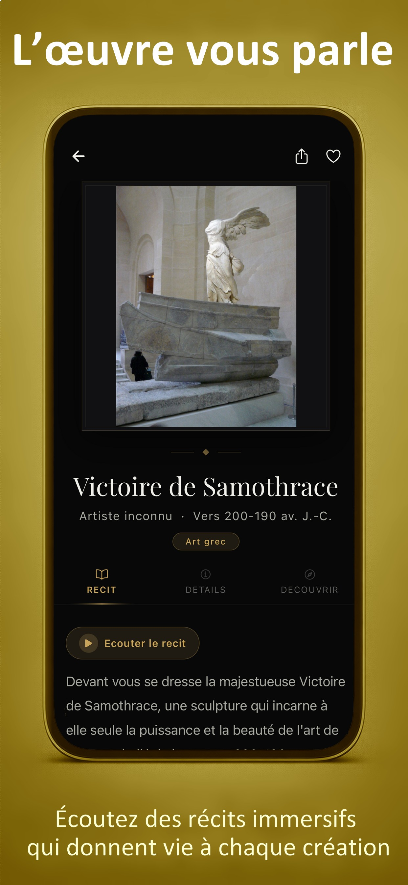
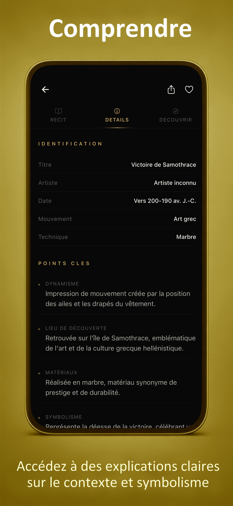
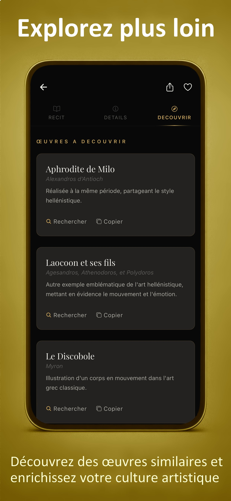

#  Artnalyse - Case Study

> L'audioguide de musée dans votre poche — analysez n'importe quelle oeuvre d'art avec l'IA

<div align="center">

[](https://apps.apple.com/fr/app/artnalyse/id6762506288)
[](https://play.google.com/store/apps/details?id=fr.goethals.artnalyse)
[](https://reactnative.dev/)
[](https://expo.dev/)
[](https://openai.com/)

**[📱 App Store](https://apps.apple.com/fr/app/artnalyse/id6762506288) · [🤖 Google Play](https://play.google.com/store/apps/details?id=fr.goethals.artnalyse) · [🌐 Site Web](https://goethals.fr/artnalyse/)**

</div>

---

<div align="center">
  
  
  
  
</div>

---

## 📑 Sommaire

- [👋 Vision Produit](#-vision-produit)
- [🎯 Le Problème Résolu](#-le-problème-résolu)
- [🚀 Innovation Clé](#-innovation-clé)
- [🤖 Pipeline IA](#-pipeline-ia)
- [🎨 Design System "Le Vernissage"](#-design-system-le-vernissage)
- [🏗️ Architecture Technique](#️-architecture-technique)
- [🛠️ Stack Technique](#️-stack-technique)
- [📱 Écrans & Navigation](#-écrans--navigation)
- [🏆 Compétences Mises en Oeuvre](#-compétences-mises-en-oeuvre)
- [📊 Métriques & Publication](#-métriques--publication)
- [🚀 Roadmap](#-roadmap)

---

## 👋 Vision Produit

**Artnalyse transforme votre smartphone en audioguide de musée universel.**

Chaque oeuvre d'art raconte une histoire — mais combien de visiteurs repartent sans l'avoir entendue ? Les audioguides traditionnels coûtent cher, couvrent un musée précis, et leur contenu est figé. Artnalyse résout ce problème fondamental : **photographier une oeuvre suffit pour obtenir une analyse complète, personnalisée et audio.**

> *"Votre galerie personnelle, partout dans le monde."*

Ce repo documente l'ensemble de la démarche produit :
- Vision et positionnement marché
- Architecture IA temps réel
- Design system premium
- Choix techniques et trade-offs
- Processus de publication App Store

---

## 🎯 Le Problème Résolu

### L'expérience muséale actuelle est sous-optimisée

| Problème | Impact |
|---------|--------|
| **Audioguides payants** | 3-5€/visite, disponibles uniquement au guichet |
| **Couverture limitée** | Seulement les oeuvres "stars", 10-20% du catalogue |
| **Contenu statique** | Même texte lu depuis 10 ans, aucune personnalisation |
| **Friction d'usage** | Casque obligatoire, numéros à retenir, interface années 2000 |
| **Pas de trace** | Impossible de retrouver les oeuvres vues après la visite |

### L'opportunité de marché

- **1,2 milliard** de visites de musées par an en Europe
- **70%** des visiteurs ne prennent pas d'audioguide (prix + friction)
- **Zéro** application mobile capable d'identifier ET analyser une oeuvre inconnue
- **Croissance** du tourisme culturel post-COVID (+23% en 2024)

---

## 🚀 Innovation Clé

### 5 innovations combinées inédites

**1. Analyse universelle par vision IA**
N'importe quelle oeuvre, n'importe où dans le monde — pas de base de données à maintenir.

**2. Streaming temps réel 5 sections**
L'analyse s'affiche progressivement comme un audioguide qui "pense". L'utilisateur voit la réponse se construire, pas d'écran de chargement.

**3. Reverse image search automatique**
Sans cartel photo, Artnalyse interroge Google Lens (SerpAPI) pour identifier l'oeuvre avant de la soumettre à l'IA. Le LLM reçoit un "hint" enrichi.

**4. Narration audio générée à la volée**
Le texte narratif est transformé en audio (OpenAI TTS) et synchronisé avec l'affichage. Slider de position, vitesse variable, cache local.

**5. Design "musée premium"**
Thème "Le Vernissage" — l'app doit RESSENTIR comme une expérience culturelle haut de gamme, pas une app utilitaire.

---

## 🤖 Pipeline IA

### Architecture de bout en bout

```
📱 Mobile App (React Native)
│
├── CaptureScreen
│   ├── Photo oeuvre (expo-camera)
│   ├── [Optionnel] Photo cartel
│   └── [Optionnel] Artiste + Titre (saisis manuellement)
│
↓ useStreamingAnalysis hook
│
├── XMLHttpRequest (streaming natif React Native)
│   └── POST → Supabase Edge Function (Deno)
│       │
│       ├── [Condition] Pas de cartel ET pas de saisie manuelle
│       │   └── SerpAPI Google Lens (reverse image search, timeout 16s)
│       │       └── Scoring algorithm → "hint" enrichi pour le LLM
│       │
│       └── OpenAI GPT-5 Vision (stream: true)
│           └── NDJSON progressif, 5 lignes
│
↓ Stream NDJSON (ligne par ligne)
│
├── Section 1 : identification  → { titre, artiste, année, période, mouvement, technique, dimensions, localisation }
├── Section 2 : narrative       → { text: "200-250 mots audioguide" } → TTS
├── Section 3 : key_points      → [{ label, value }, ×4-5]
├── Section 4 : anecdote        → { titre, contenu }
└── Section 5 : related_artworks → [{ titre, artiste, raison }, ×4]

↓ Audio TTS (parallèle)
│
└── Supabase Edge Function (openai-tts-stream)
    └── OpenAI TTS → MP3 streamé → FileSystem local → expo-audio
        └── Contrôles : play/pause, ±5s/+15s, vitesse 0.75x-2x, seek slider
```

### Choix technique : XMLHttpRequest vs fetch

React Native ne supporte pas le streaming fetch nativement. Le choix de `XMLHttpRequest` avec lecture progressive de `responseText` permet de recevoir le NDJSON ligne par ligne, sans attendre la réponse complète.

### Reverse Image Search : scoring algorithm

```typescript
// Scores calculés sur les résultats Google Lens :
// - Correspondance titre exacte : +0.4
// - Correspondance artiste : +0.3
// - Présence dans institution muséale connue : +0.2
// - Cohérence date/période : +0.1

// Niveaux de confiance transmis au LLM :
// High (≥0.8) : "J'ai identifié avec certitude..."
// Medium (≥0.5) : "Il s'agit probablement de..."
// Low (<0.5) : "Cette oeuvre pourrait être..."
```

---

## 🎨 Design System "Le Vernissage"

### Philosophie

L'interface doit évoquer l'ambiance d'un vernissage — l'intimité d'une galerie privée, la qualité d'un catalogue d'exposition, la chaleur tamisée de l'éclairage muséal.

### Palette

| Token | Valeur | Usage |
|-------|--------|-------|
| `background` | `#080808` | Fond principal |
| `surface` | `#111113` | Cartes, modals |
| `surfaceAlt` | `#1a1a1c` | Éléments secondaires |
| `gold` | `#c9a55c` | Accent principal, CTA |
| `goldLight` | `#d4b46a` | États hover |
| `goldDark` | `#a88845` | États pressed |
| `ivory` | `#f0efe9` | Texte principal |
| `warmGray` | `#b8b5af` | Texte secondaire |

### Typographie

- **Playfair Display** (serif) — titres, noms d'oeuvres, artistes
- **Système** (san-serif) — corps de texte, UI

### Effets visuels

- **Gold glow shadows** : `box-shadow: 0 0 20px rgba(201, 165, 92, 0.3)`
- **Ambient particles** : particules flottantes animées en arrière-plan
- **Breathing animation** : oscillation douce (3000ms) sur les éléments actifs
- **FadeInView** : entrées directionnelles (up/down/left/right) avec slide + opacity
- **GoldDivider** : séparateur décoratif or entre sections
- **Ornamental borders** : bordures fines or sur les cartes premium

---

## 🏗️ Architecture Technique

### Structure de l'app

```
src/
├── screens/
│   ├── HomeScreen.tsx        # Menu principal + collection historique
│   ├── CaptureScreen.tsx     # Capture photo + saisie optionnelle cartel/artiste
│   ├── ResultScreen.tsx      # Analyse streaming + player audio + tabs
│   ├── HistoryScreen.tsx     # Historique (filtre favoris)
│   └── SettingsScreen.tsx    # Préférences + gestion données
│
├── hooks/
│   ├── useStreamingAnalysis.ts  # Orchestration streaming NDJSON
│   └── useTTS.ts                # Lecture audio (expo-audio)
│
├── lib/
│   ├── types.ts              # Types TypeScript (ArtworkAnalysisResponse, HistoryItem...)
│   ├── theme.ts              # Design tokens "Le Vernissage"
│   ├── supabase/client.ts    # Client Supabase
│   └── tts-stream-client.ts  # Download TTS → FileSystem
│
├── stores/
│   └── app-store.ts          # Zustand (history max 100, favoris, préférences)
│
└── components/
    ├── FadeInView.tsx         # Animation entrée
    ├── GoldDivider.tsx        # Séparateur décoratif
    ├── AmbientParticles.tsx   # Fond animé
    └── FontProvider.tsx       # Chargement Playfair Display

supabase/
├── artwork-analysis-stream/  # Edge Function principale (Deno)
│   ├── index.ts              # Orchestration + reverse search + streaming
│   ├── prompts.ts            # Prompts LLM
│   └── reverse-image-search.ts  # SerpAPI Google Lens + scoring
└── openai-tts-stream/        # Edge Function TTS
    └── index.ts
```

### Persistance

```typescript
interface HistoryItem {
  id: string;
  title: string;
  artist: string;
  createdAt: string;
  data: ArtworkAnalysisResponse;
  imageBase64?: string;
  thumbnailBase64?: string;
  isFavorite?: boolean;
  audioPath?: string;       // MP3 cached localement
}

// Store Zustand → AsyncStorage 'artnalyse-storage-v2'
// Limite : 100 oeuvres en historique
```

---

## 🛠️ Stack Technique

| Couche | Technologie | Choix |
|--------|------------|-------|
| **Framework** | React Native + Expo SDK | Cross-platform iOS/Android, DX rapide |
| **Langage** | TypeScript | Type safety end-to-end |
| **Backend** | Supabase Edge Functions (Deno) | Serverless, proche OpenAI API, streaming natif |
| **IA Vision** | OpenAI GPT-5 Vision | Meilleure reconnaissance visuelle disponible |
| **TTS** | OpenAI TTS | Qualité audio naturelle, voix multiples |
| **Image Search** | SerpAPI Google Lens | Identification oeuvres sans base propriétaire |
| **State** | Zustand + AsyncStorage | Léger, persisté, typé |
| **Audio** | expo-audio | Lecture MP3 locale, contrôle complet |
| **Caméra** | expo-camera + expo-image-picker | Capture + import galerie |
| **Navigation** | React Navigation (Stack) | Standard React Native |

---

## 📱 Écrans & Navigation

```
App
├── HomeScreen
│   ├── Bouton "Analyser une oeuvre" → CaptureScreen
│   └── Collection récente → ResultScreen (depuis historique)
│
├── CaptureScreen
│   ├── Photo oeuvre (caméra ou galerie)
│   ├── [Optionnel] Photo cartel (aide l'identification)
│   └── [Optionnel] Artiste + Titre saisis
│
├── ResultScreen
│   ├── AnalysisProgress (badge en direct : "Recherche... Identification... Narration...")
│   ├── AudioPlayer (play/pause, ±5s/+15s, vitesse, slider)
│   └── Tabs : Récit | Détails | Découvrir
│       ├── Récit : texte narratif (200-250 mots)
│       ├── Détails : identification + points clés + anecdote
│       └── Découvrir : 4 oeuvres similaires recommandées
│
├── HistoryScreen
│   └── Liste oeuvres analysées (filtre favoris)
│
└── SettingsScreen
    └── Haptics, langue, vider l'historique
```

---

## 🏆 Compétences Mises en Oeuvre

### Product Management
- **Identification d'un pain point réel** : l'audioguide est un problème résolu à moitié depuis 30 ans
- **Positioning clair** : pas une app "d'art générale" mais un outil de visite muséale
- **UX minimaliste** : 3 taps max pour avoir une analyse complète
- **Monétisation pensée en amont** : freemium (5 analyses/mois), premium illimité, B2B musées

### Architecture IA
- **Streaming temps réel** : UX bien supérieure au "chargement 10 secondes"
- **Enrichissement contextuel** : reverse image search comme couche de connaissance supplémentaire
- **Fallback gracieux** : si Google Lens rate, l'IA analyse quand même directement
- **Cache intelligent** : audio TTS stocké localement, pas re-généré à chaque consultation

### Design & UX Mobile
- **Thème cohérent bout en bout** : chaque pixel renforce l'identité "musée premium"
- **Feedback instantané** : l'utilisateur voit la réponse se construire section par section
- **Tab dynamique** : repositionnement du tab bar après fin de streaming, calculé via onLayout
- **ImageView** : zoom double-tap + swipe-to-close sur les oeuvres

### Publication App Store
- Configuration Expo EAS (eas.json, app.config.js)
- Gestion des permissions iOS (camera, photo library)
- Optimisation bundle (metro bundler, assets)
- Processus de review App Store (conformité guidelines)

---

## 📊 Métriques & Publication

| Indicateur | Valeur |
|-----------|--------|
| **Version** | 1.0.6 (build 6) |
| **Bundle ID** | `com.artnalyse.app` |
| **Plateforme** | iOS (iPhone) |
| **Orientation** | Portrait uniquement |
| **Langues** | Français + Anglais |
| **Publication** | App Store (iOS) + Google Play (Android) |

---

## 🚀 Roadmap

### V1 (actuelle) ✅
- Analyse IA streaming 5 sections
- Narration audio TTS
- Reverse image search Google Lens
- Historique + favoris
- Design "Le Vernissage"

### V2 (prévue)
- [ ] Mode "visite guidée" : navigation entre oeuvres d'un même musée
- [ ] Partage de collection (lien public vers une oeuvre analysée)
- [ ] Mode "cartel" : photographier le cartel seul pour enrichir l'analyse
- [ ] Internationalisation (EN, ES, DE, IT)

### V3 (vision)
- [ ] B2B : SDK pour musées (intégration dans leur app officielle)
- [ ] Mode offline : pré-téléchargement des analyses pour une expo
- [ ] Social : "galerie partagée" entre amis visitant le même musée

---

## 📚 Documentation Détaillée

- **[01 - Vision Produit](./docs/01-vision-produit.md)** — Marché, personas, positionnement
- **[02 - Pipeline IA](./docs/02-pipeline-ia.md)** — Architecture technique complète
- **[03 - Design System](./docs/03-design-system.md)** — "Le Vernissage" — tokens, composants, principes
- **[04 - Architecture](./docs/04-architecture-technique.md)** — Choix techniques et trade-offs

---

<div align="center">

**Artnalyse** — Développé de la vision produit à la publication App Store par [Antoine Goethals](https://github.com/GtAntoine)

*React Native · Expo · OpenAI GPT-5 Vision · Supabase Edge Functions · TypeScript*

</div>
